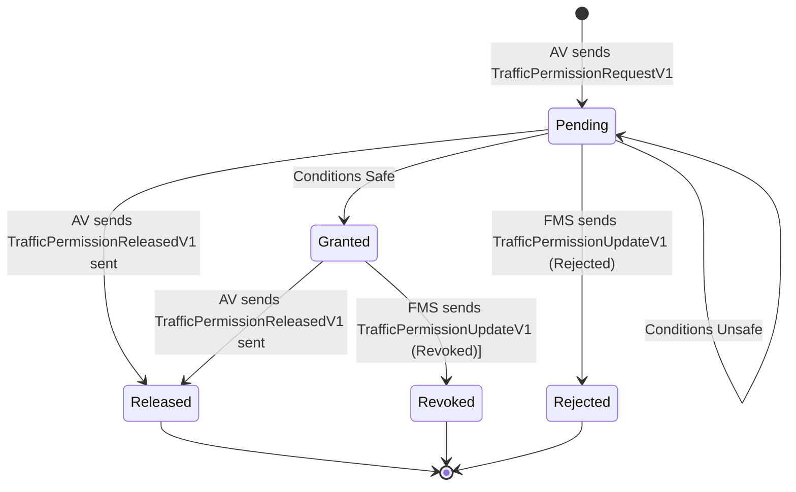

# Traffic Management
Autonomous vehicles (AVs) operating within mine sites must coordinate safely with other vehicles in the pit. This includes passing static obstacles like roadworks or broken-down vehicles and traversing narrow single-lane roads. In both cases, the AV must avoid conflicts with oncoming traffic, which may include other AVs or staffed instrumented vehicles (SIVs) operated by humans.

To coordinate traffic safely and efficiently, the FMS should enable creation of [policy zones](https://github.com/open-autonomy/zone/blob/main/README.md) with an attached [trafficPermission policy](https://github.com/open-autonomy/zone/blob/add-free-plan-and-traffic-permission-policies/specification/V1/policies.md#traffic-permission). These zones define bounded mine site regions where AVs must obtain permission from the Fleet Management System (FMS) before entering, while the FMS ensures that vehicle movement within these zones to avoid conflicts.

### Language
| Acronyms | Extended Name |
| --- | --- |
| AHS | Autonomous Haulage System |
| AV | Autonomous Vehicle|
| FMS | Fleet Management System |
| SIV | Staffed Instrumented Vehicle |

## Traffic Management Specification
This repository defines the messages and protocols for AVs to communicate with an FMS to obtain the required permissions to enter zones with trafficPermission policies. 

For more information on the messages used in the V1 protocol for managing policy zones, see the [V1 Specification](specification/V1/README.md).

## Traffic Permission State Machine

Traffic permissions can be in one of five states: `Pending`, `Granted`, `Released`, `Rejected`, or `Revoked`. The following diagram illustrates the state transitions for traffic permissions:

> [!NOTE]
> The FMS may choose to send `Granted` or `Rejected` status immediately upon receiving a `TrafficPermissionRequestV1` message, depending on current conditions.
> The `Revoked` status indicates that the AV must make every effort to avoid entering the zone, or make a best-effort stop if already inside the zone.

## Sequence diagrams

See [Sequence Diagrams](diagram/SequenceDiagrams.md) for a detailed set of scenarios that describe the interactions between the FMS, AHS, and AV when managing policy zones.

## Communication Protocols

This specification does not indicate the use of any specific communication protocol between the FMS and AHS. Providing the protocols can meet the requirements, integrators can choose to support for one or more protocols such as HTTP, WebSockets, or MQTT

All communications protocols selected must be implemented to meet the following requirements:
 - Connections are monitored from both sides
 - Communications are managed asynchronously

## Permissions

The FMS is the source of truth for traffic permissions with respect to zones with a `trafficPermission` policy. The FMS is responsible for granting, rejecting, revoking, and releasing traffic permissions for AVs, and is required to communicate these changes to the AVs in a timely manner.

## Reporting Vehicle Degradations

In the event that the AV encounters an issue while traversing a zone with a `trafficPermission` policy, it should report the cause of the issue to the FMS using the [MachineDiagnosticV2](https://github.com/open-autonomy/dispatch/blob/main/specification/MachineDiagnosticV2.md) message defined in the [Dispatch Specification](https://github.com/open-autonomy/dispatch/tree/main). This message allows the AV to communicate diagnostic information, including error codes and descriptions, to the FMS for further analysis and resolution.

