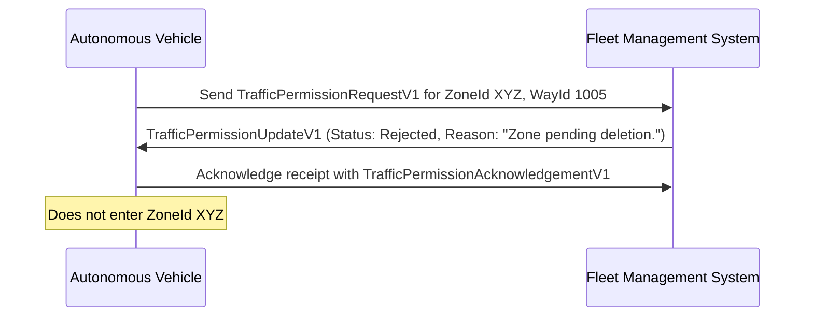

# Request Rejection

In scenarios where an Autonomous Vehicle (AV) requests permission to enter a zone but the Fleet Management System (FMS) determines that the request cannot be granted, the FMS will respond with a `TrafficPermissionUpdateV1` message indicating that the request has been rejected.

## Request Rejection Flow

The following sequence diagram illustrates a typical flow for a request rejection:

