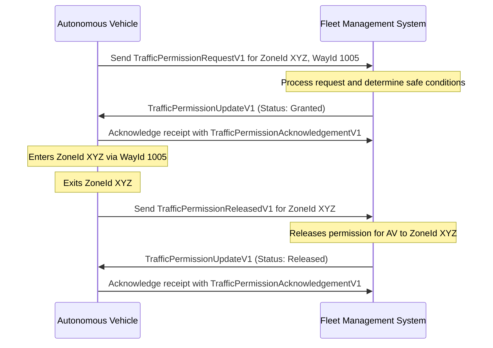
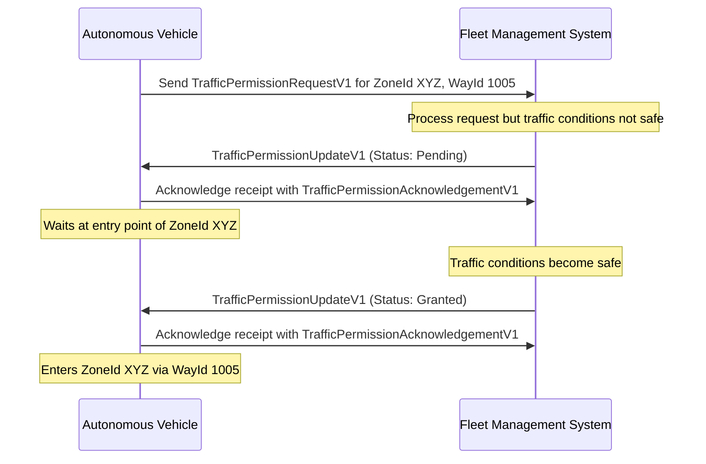
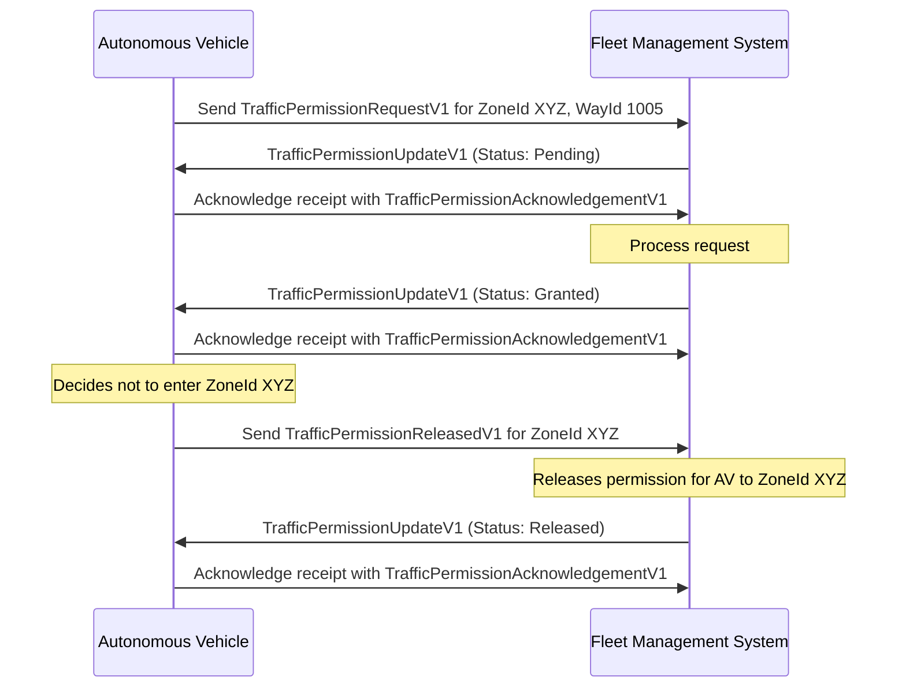
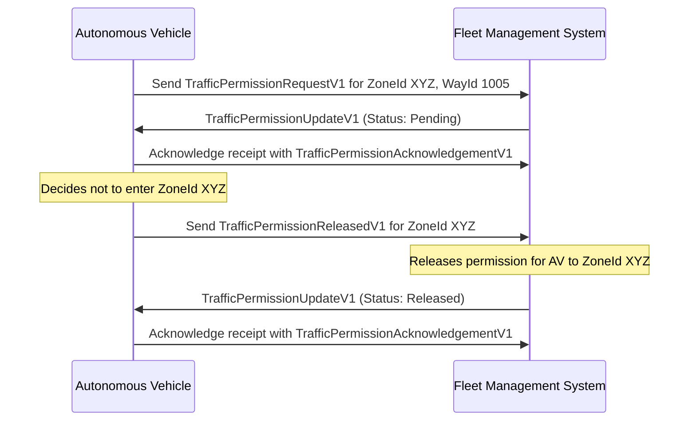
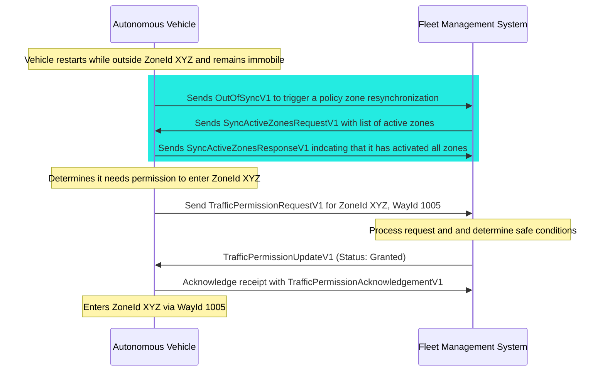
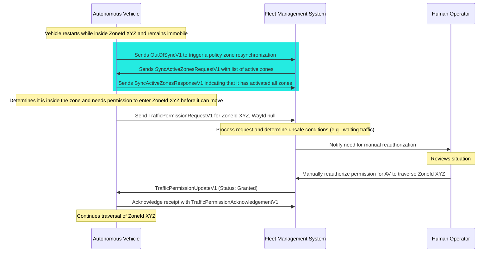

# Requesting Permission
Vehicles that wish to enter a zone governed by a `trafficPermission` policy must first request permission from the Fleet Management System (FMS) using the `TrafficPermissionRequestV1` message. The FMS will then respond with a `TrafficPermissionUpdateV1` message indicating whether the permission request is pending, granted, rejected, or revoked.

> [!IMPORTANT]
> All systems shall implement idempotency when managing traffic permissions.

## Typical Traffic Permission Request Flow

The following sequence diagram illustrates a typical flow for requesting and receiving traffic permission:

## Waiting for Traffic Permissions

A common scenario involves an Autonomous Vehicle (AV) requesting permission to enter a zone but needing to wait until conditions are safe. In this case, the FMS may initially respond with a `TrafficPermissionUpdateV1` message indicating that the request is `"Pending"`. Once conditions are deemed safe, the FMS will send another `TrafficPermissionUpdateV1` message with the status `"Granted"`.

## Releasing Traffic Permission before Entry
If an Autonomous Vehicle (AV) decides not to enter a zone after requesting permission but before actually entering, it should send a `TrafficPermissionReleasedV1` message to the Fleet Management System, as shown below:

The AV may also release permissions prior to receiving a grant, for example if conditions change while waiting.

## Recovering from Vehicle Restarts

In the event of a vehicle restart, the Autonomous Vehicle (AV) must re-establish its traffic permissions with the Fleet Management System (FMS). The AV should resend any necessary `TrafficPermissionRequestV1` messages for zones it intends to enter (or is inside). The FMS will respond with the appropriate `TrafficPermissionUpdateV1` messages based on the current status of the requests.

> [!IMPORTANT]
> After a restart, the AV must not assume that previous permissions are still valid. It must explicitly request permission again to ensure compliance with traffic management policies.

The following diagram illustrates the flow when the AV was outside a zone prior to the restart and can automatically recover permission (the blue box indicates resynchronization of active zones after restart):

> [!NOTE]
> The FMS may require human intervention to manually reauthorizing permissions in situations where automatic recovery is not possible or safe.

The following diagram illustrates the flow when the AV was inside a zone prior to the restart and requires manual intervention to reauthorize permission (the blue box indicates resynchronization of active zones after restart):

