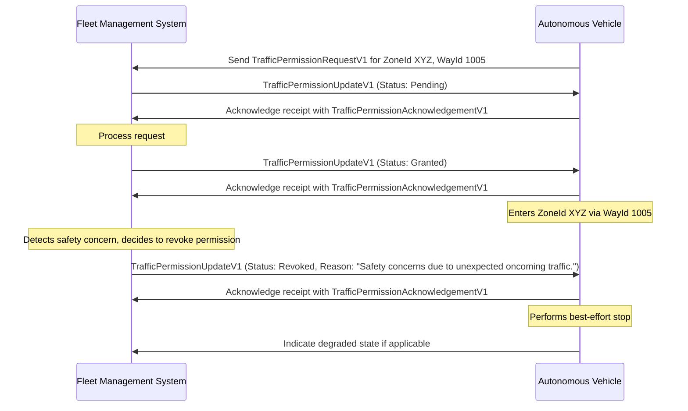

# Revoking Permission

In certain situations, the Fleet Management System (FMS) may need to revoke previously granted traffic permission for an Autonomous Vehicle (AV) to enter a zone governed by a `trafficPermission` policy. This revocation is communicated to the AV using the `TrafficPermissionUpdateV1` message with the status set to `"Revoked"`. Situations that may warrant revocation include safety concerns, changes in traffic conditions, or vehicle malfunctions.

## Revocation Flow

"The following sequence diagram illustrates a typical flow for revoking traffic permission:

> [!IMPORTANT]
> Upon receiving a `TrafficPermissionUpdateV1` message with the status `"Revoked"`, the Autonomous Vehicle (AV) must make every effort to avoid entering the zone. If the AV is already inside the zone, it should perform a best-effort stop as soon as it is safe to do so.